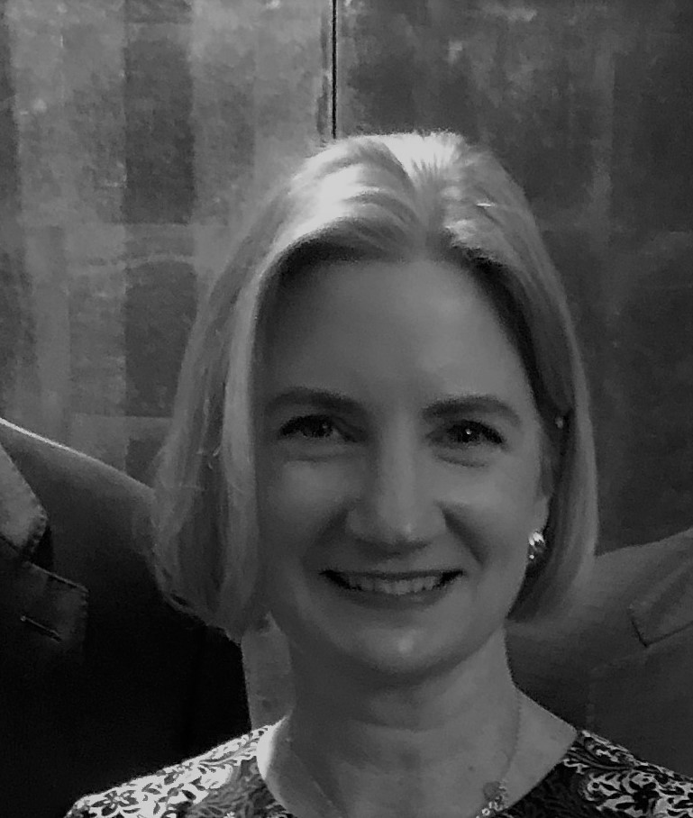

# Meet the team

## Kimberly Kusters

### Co-Founder and CEO
Kimberly's passion, vision, and determination is what makes kusters.tech possible.  She is the only member of the kusters.tech team who has previously started and owned her own company.  Now she is diving in head first into the tech startup world.

## Norbert Kusters

### Co-Founder and CTO
Norbert has 25+ years under his belt as a software engineer and software architect for top tech companies including Microsoft and Amazon.  Remember CHKDSK? Yeah, he created that.  He is now leveraging his expertise in a new direction with kusters.tech. 

## Emma Kusters

### COO
Emma is a strong leader and has several years of experience managing clients, developers, and website solutions for 10s of thousands of customers.  As COO of kusters.tech, Emma is now managing all operations for a tech startup that has huge potential to impact millions of customers. 

## Madeline Kusters

### CSO
Madeline is a young, up-and-coming technical entrepreneur.  She has worked as a software engineer at top tech companies including Microsoft, Intuit, and Amazon.  Her recent stint in Silicon Valley has inspired a hunger to create a lean tech startup.

## Ethan Kusters

### CIO
Ethan has been taking apart computers and building tech solutions since he was five years old.  He is passionate about building cool new solutions that will have big impact.

